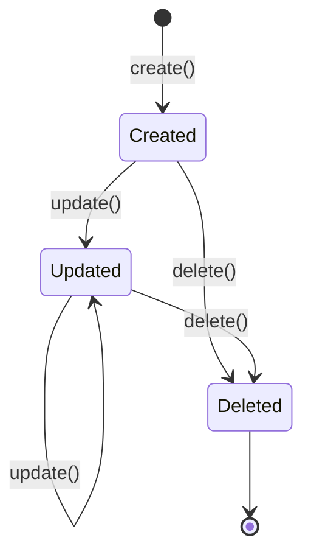
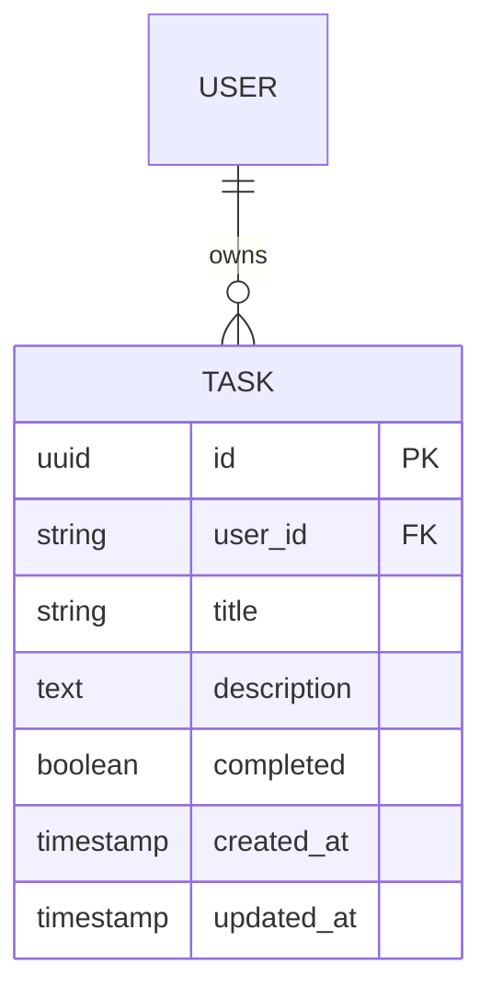

# Data Model: Core Backend & Data Layer

**Feature**: `001-backend-data-layer`  
**Date**: 2026-01-13  
**Spec Reference**: [spec.md](./spec.md)

## Entities

### Task

Represents a todo item belonging to a user. This is the core entity for the data layer.

#### Attributes

| Field         | Type            | Nullable | Default                | Constraints             | Description                    |
| ------------- | --------------- | -------- | ---------------------- | ----------------------- | ------------------------------ |
| `id`          | UUID            | No       | Auto-generated (uuid4) | PRIMARY KEY             | Unique identifier for the task |
| `user_id`     | String(255)     | No       | -                      | INDEXED, NOT NULL       | Owner's user identifier        |
| `title`       | String(255)     | No       | -                      | NOT NULL, max 255 chars | Task title                     |
| `description` | Text            | Yes      | NULL                   | -                       | Optional detailed description  |
| `completed`   | Boolean         | No       | `false`                | NOT NULL                | Completion status              |
| `created_at`  | Timestamp (UTC) | No       | Current timestamp      | NOT NULL                | Record creation time           |
| `updated_at`  | Timestamp (UTC) | No       | Current timestamp      | NOT NULL, ON UPDATE     | Last modification time         |

#### Indexes

| Index Name         | Columns   | Type        | Purpose               |
| ------------------ | --------- | ----------- | --------------------- |
| `pk_tasks`         | `id`      | PRIMARY KEY | Unique identification |
| `ix_tasks_user_id` | `user_id` | B-TREE      | Fast lookup by owner  |

#### Validation Rules

1. **title**: Required, 1-255 characters, cannot be empty string
2. **user_id**: Required, non-empty string (no empty/whitespace-only values)
3. **completed**: Defaults to `false` if not provided
4. **description**: Optional, no length limit (TEXT type)

#### State Transitions



**State Rules**:

- Task is created with `completed=false` by default
- Task can be updated multiple times (updates `updated_at`)
- Task can be deleted at any state
- No soft-delete; deletion is permanent

## Relationships

### Task → User (Conceptual)



**Notes**:

- User table is NOT created in this spec (out of scope)
- `user_id` is a string reference to external user identity
- Ownership enforced via `user_id` in all queries
- No foreign key constraint to user table (user management is separate spec)

## SQLModel Definition

```python
from datetime import datetime, timezone
from typing import Optional
from uuid import UUID, uuid4

from sqlmodel import Field, SQLModel


class TaskBase(SQLModel):
    """Base model with shared fields for validation"""
    title: str = Field(max_length=255, min_length=1)
    description: Optional[str] = Field(default=None)
    completed: bool = Field(default=False)


class Task(TaskBase, table=True):
    """Database model for tasks table"""
    __tablename__ = "tasks"

    id: UUID = Field(default_factory=uuid4, primary_key=True)
    user_id: str = Field(max_length=255, nullable=False, index=True)
    created_at: datetime = Field(
        default_factory=lambda: datetime.now(timezone.utc),
        nullable=False
    )
    updated_at: datetime = Field(
        default_factory=lambda: datetime.now(timezone.utc),
        nullable=False
    )


class TaskCreate(TaskBase):
    """Model for creating a new task (user_id added separately)"""
    pass


class TaskUpdate(SQLModel):
    """Model for updating a task (all fields optional)"""
    title: Optional[str] = Field(default=None, max_length=255, min_length=1)
    description: Optional[str] = None
    completed: Optional[bool] = None


class TaskRead(TaskBase):
    """Model for reading a task (includes all fields)"""
    id: UUID
    user_id: str
    created_at: datetime
    updated_at: datetime
```

## Database Schema (PostgreSQL DDL)

```sql
-- Table: tasks
CREATE TABLE IF NOT EXISTS tasks (
    id UUID PRIMARY KEY DEFAULT gen_random_uuid(),
    user_id VARCHAR(255) NOT NULL,
    title VARCHAR(255) NOT NULL,
    description TEXT,
    completed BOOLEAN NOT NULL DEFAULT FALSE,
    created_at TIMESTAMP WITH TIME ZONE NOT NULL DEFAULT NOW(),
    updated_at TIMESTAMP WITH TIME ZONE NOT NULL DEFAULT NOW()
);

-- Index: user_id for ownership queries
CREATE INDEX IF NOT EXISTS ix_tasks_user_id ON tasks (user_id);

-- Trigger: auto-update updated_at on modification
CREATE OR REPLACE FUNCTION update_updated_at_column()
RETURNS TRIGGER AS $$
BEGIN
    NEW.updated_at = NOW();
    RETURN NEW;
END;
$$ language 'plpgsql';

CREATE TRIGGER update_tasks_updated_at
    BEFORE UPDATE ON tasks
    FOR EACH ROW
    EXECUTE FUNCTION update_updated_at_column();
```

## Ownership Enforcement

All data access operations MUST include user_id filtering:

```python
# Example: Get task by ID (ownership enforced)
async def get_task(session: AsyncSession, task_id: UUID, user_id: str) -> Task | None:
    statement = select(Task).where(Task.id == task_id, Task.user_id == user_id)
    result = await session.execute(statement)
    return result.scalar_one_or_none()

# Example: List tasks for user (ownership implicit)
async def list_tasks(session: AsyncSession, user_id: str) -> list[Task]:
    statement = select(Task).where(Task.user_id == user_id)
    result = await session.execute(statement)
    return result.scalars().all()

# Example: Update task (ownership enforced)
async def update_task(session: AsyncSession, task_id: UUID, user_id: str, data: TaskUpdate) -> Task | None:
    task = await get_task(session, task_id, user_id)
    if not task:
        return None  # Not found OR not owned by user
    # ... apply updates
    return task
```

## Migration Strategy

Using Alembic for versioned migrations:

1. **Initial migration**: Create `tasks` table with all columns and indexes
2. **Future migrations**: Add columns, modify constraints as needed
3. **Rollback**: Each migration has `upgrade()` and `downgrade()` functions

```
alembic/
├── env.py
├── script.py.mako
├── versions/
│   └── 001_create_tasks_table.py
└── alembic.ini
```
