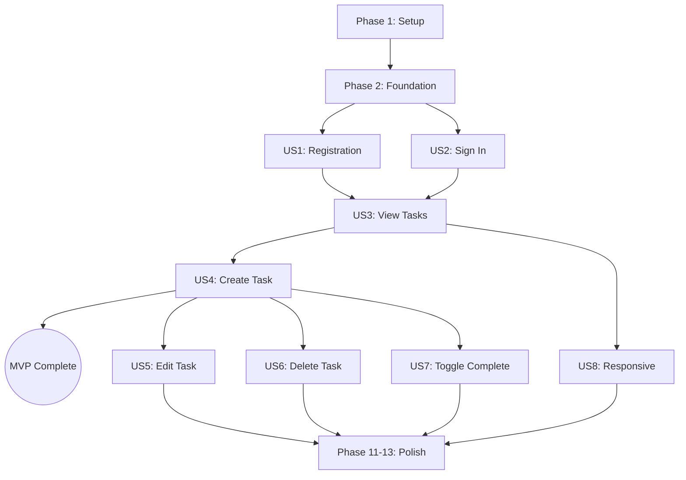

# Tasks: Frontend Application & Modern UX

**Feature Branch**: `004-frontend-modern-ux`  
**Input**: Design documents from `specs/004-frontend-modern-ux/`  
**Prerequisites**: plan.md ✅, spec.md ✅, research.md ✅, quickstart.md ✅

**Tests**: E2E tests with Playwright as specified in verification plan.

**Organization**: Tasks grouped by user story (8 stories) to enable independent implementation and testing.

## Format: `[ID] [P?] [Story] Description`

- **[P]**: Can run in parallel (different files, no dependencies)
- **[Story]**: Which user story (US1-US8) from spec.md

## Path Conventions

- **Frontend**: `frontend/`
- **App Routes**: `frontend/app/`
- **Components**: `frontend/components/`
- **Library**: `frontend/lib/`

---

## Phase 1: Setup (Project Foundation)

**Purpose**: Initialize Next.js 16+ project with proper configuration

- [ ] T001 Install Next.js 16+ using `npx -y create-next-app@latest ./` with App Router and TypeScript in `frontend/`
- [ ] T002 [P] Configure strict TypeScript in `frontend/tsconfig.json`
- [ ] T003 [P] Configure ESLint with strict rules in `frontend/eslint.config.js`
- [ ] T004 Install Tailwind CSS v4 and configure in `frontend/tailwind.config.ts`
- [ ] T005 [P] Create global styles with Tailwind imports in `frontend/styles/globals.css`
- [ ] T006 [P] Configure Next.js settings in `frontend/next.config.ts`
- [ ] T007 Install dependencies: React Query, Headless UI, React Hook Form, Zod, Playwright
- [ ] T008 [P] Create environment variables file `frontend/.env.local` from example
- [ ] T009 Verify development server runs with `npm run dev`
- [ ] T010 Verify production build succeeds with `npm run build`

**Checkpoint**: Project runs locally with zero console errors ✅

---

## Phase 2: Foundational (Blocking Prerequisites)

**Purpose**: Core infrastructure required by ALL user stories

- [ ] T011 Create React Query provider in `frontend/lib/query-client.ts`
- [ ] T012 [P] Enhance API client with error handling in `frontend/lib/api.ts`
- [ ] T013 [P] Create auth session hook in `frontend/lib/hooks/useSession.ts`
- [ ] T014 Create root layout with providers in `frontend/app/layout.tsx`
- [ ] T015 [P] Create Button component in `frontend/components/ui/Button.tsx`
- [ ] T016 [P] Create Input component in `frontend/components/ui/Input.tsx`
- [ ] T017 [P] Create Modal component using Headless UI in `frontend/components/ui/Modal.tsx`
- [ ] T018 [P] Create Toast component in `frontend/components/ui/Toast.tsx`
- [ ] T019 Create ToastProvider context in `frontend/lib/contexts/ToastContext.tsx`
- [ ] T020 Create route protection middleware in `frontend/middleware.ts`

**Checkpoint**: Foundation ready - user story implementation can begin ✅

---

## Phase 3: User Story 1 - New User Registration (Priority: P1) 🎯 MVP

**Goal**: New user can create an account and access dashboard

**Independent Test**: Sign up form → Submit → Redirect to dashboard

### Implementation

- [ ] T021 [US1] Create auth layout in `frontend/app/(auth)/layout.tsx`
- [ ] T022 [US1] Create sign-up page in `frontend/app/(auth)/sign-up/page.tsx`
- [ ] T023 [US1] Create SignUpForm component in `frontend/components/auth/SignUpForm.tsx`
- [ ] T024 [US1] Add form validation schema for sign-up in `frontend/lib/schemas/auth.ts`
- [ ] T025 [US1] Implement sign-up submission with Better Auth
- [ ] T026 [US1] Add loading state during registration
- [ ] T027 [US1] Add error display for failed registration
- [ ] T028 [US1] Add redirect to dashboard on success
- [ ] T029 [US1] Add link to sign-in page from sign-up

**Checkpoint**: New users can register and land on dashboard ✅

---

## Phase 4: User Story 2 - Returning User Authentication (Priority: P1) 🎯 MVP

**Goal**: Returning user can sign in and access their tasks

**Independent Test**: Sign in form → Submit → Redirect to dashboard

### Implementation

- [ ] T030 [US2] Create sign-in page in `frontend/app/(auth)/sign-in/page.tsx`
- [ ] T031 [US2] Create SignInForm component in `frontend/components/auth/SignInForm.tsx`
- [ ] T032 [US2] Add form validation schema for sign-in in `frontend/lib/schemas/auth.ts`
- [ ] T033 [US2] Implement sign-in submission with Better Auth
- [ ] T034 [US2] Add loading state during authentication
- [ ] T035 [US2] Add error display for invalid credentials
- [ ] T036 [US2] Add redirect to dashboard on success
- [ ] T037 [US2] Add link to sign-up page from sign-in
- [ ] T038 [US2] Implement sign-out functionality in `frontend/lib/auth.ts`

**Checkpoint**: Users can sign in/out and access protected routes ✅

---

## Phase 5: User Story 3 - View Task List (Priority: P1) 🎯 MVP

**Goal**: Authenticated user sees their task list on dashboard

**Independent Test**: Navigate to dashboard → See task list (or empty state)

### Implementation

- [ ] T039 [US3] Create dashboard layout in `frontend/app/(dashboard)/layout.tsx`
- [ ] T040 [US3] Create Navbar component in `frontend/components/layout/Navbar.tsx`
- [ ] T041 [US3] Create Sidebar component in `frontend/components/layout/Sidebar.tsx`
- [ ] T042 [US3] Create MobileDrawer component in `frontend/components/layout/MobileDrawer.tsx`
- [ ] T043 [US3] Create dashboard page in `frontend/app/(dashboard)/page.tsx`
- [ ] T044 [US3] Create useTasks hook in `frontend/lib/hooks/useTasks.ts`
- [ ] T045 [US3] Create TaskList component in `frontend/components/tasks/TaskList.tsx`
- [ ] T046 [US3] Create TaskCard component in `frontend/components/tasks/TaskCard.tsx`
- [ ] T047 [US3] Create EmptyState component in `frontend/components/ui/EmptyState.tsx`
- [ ] T048 [US3] Create Skeleton loading states in `frontend/components/ui/Skeleton.tsx`
- [ ] T049 [US3] Add error state with retry in task list

**Checkpoint**: Users see their tasks on dashboard ✅

---

## Phase 6: User Story 4 - Create New Task (Priority: P1) 🎯 MVP

**Goal**: User can add new tasks from dashboard

**Independent Test**: Click Add Task → Fill form → Submit → Task appears in list

### Implementation

- [ ] T050 [US4] Create TaskForm component in `frontend/components/tasks/TaskForm.tsx`
- [ ] T051 [US4] Add task validation schema in `frontend/lib/schemas/task.ts`
- [ ] T052 [US4] Add useCreateTask mutation in `frontend/lib/hooks/useTasks.ts`
- [ ] T053 [US4] Add "Add Task" button to dashboard
- [ ] T054 [US4] Implement create task modal flow
- [ ] T055 [US4] Add optimistic update on create
- [ ] T056 [US4] Add success toast on task creation

**Checkpoint**: MVP Complete - Users can register, sign in, view and create tasks ✅

---

## Phase 7: User Story 5 - Edit Existing Task (Priority: P2)

**Goal**: User can modify task details

**Independent Test**: Click Edit → Modify form → Save → Changes reflected

### Implementation

- [ ] T057 [US5] Add useUpdateTask mutation in `frontend/lib/hooks/useTasks.ts`
- [ ] T058 [US5] Add edit button to TaskCard component
- [ ] T059 [US5] Implement edit modal with pre-populated form
- [ ] T060 [US5] Add cancel action to discard changes
- [ ] T061 [US5] Add optimistic update on edit
- [ ] T062 [US5] Add success toast on task update

**Checkpoint**: Users can edit their tasks ✅

---

## Phase 8: User Story 6 - Delete Task (Priority: P2)

**Goal**: User can remove unwanted tasks

**Independent Test**: Click Delete → Confirm → Task removed from list

### Implementation

- [ ] T063 [US6] Create ConfirmDialog component in `frontend/components/ui/ConfirmDialog.tsx`
- [ ] T064 [US6] Add useDeleteTask mutation in `frontend/lib/hooks/useTasks.ts`
- [ ] T065 [US6] Add delete button to TaskCard component
- [ ] T066 [US6] Implement delete confirmation flow
- [ ] T067 [US6] Add optimistic update on delete
- [ ] T068 [US6] Add success toast on task deletion

**Checkpoint**: Users can delete their tasks ✅

---

## Phase 9: User Story 7 - Toggle Task Completion (Priority: P2)

**Goal**: User can mark tasks complete/incomplete

**Independent Test**: Click checkbox → Status toggles → Visual update

### Implementation

- [ ] T069 [US7] Add useToggleTask mutation in `frontend/lib/hooks/useTasks.ts`
- [ ] T070 [US7] Add completion checkbox to TaskCard
- [ ] T071 [US7] Implement optimistic toggle update
- [ ] T072 [US7] Add visual distinction for completed tasks (strikethrough, muted)
- [ ] T073 [US7] Add subtle animation on toggle

**Checkpoint**: Users can track task progress ✅

---

## Phase 10: User Story 8 - Responsive Experience (Priority: P2)

**Goal**: Application works seamlessly on all devices

**Independent Test**: Resize viewport → Layout adapts correctly

### Implementation

- [ ] T074 [US8] Implement responsive breakpoints in all layout components
- [ ] T075 [US8] Test and fix mobile navigation drawer
- [ ] T076 [US8] Ensure touch targets are minimum 44x44px
- [ ] T077 [US8] Test task cards on mobile viewport
- [ ] T078 [US8] Test forms on mobile viewport
- [ ] T079 [US8] Eliminate any horizontal scrolling

**Checkpoint**: App works on all screen sizes ✅

---

## Phase 11: UX States & Accessibility

**Purpose**: Polish UX and meet WCAG 2.1 AA

- [ ] T080 [P] Create ErrorState component in `frontend/components/ui/ErrorState.tsx`
- [ ] T081 [P] Create OfflineBanner component in `frontend/components/ui/OfflineBanner.tsx`
- [ ] T082 Add keyboard navigation support to all interactive elements
- [ ] T083 Add ARIA roles to modals and dynamic content
- [ ] T084 Validate color contrast meets 4.5:1 ratio
- [ ] T085 Add focus visible states to all components
- [ ] T086 Test with keyboard-only navigation

**Checkpoint**: Accessibility-compliant UI ✅

---

## Phase 12: Error Handling & Performance

**Purpose**: Stability and fast load times

- [ ] T087 Create global error boundary in `frontend/app/error.tsx`
- [ ] T088 [P] Create 404 page in `frontend/app/not-found.tsx`
- [ ] T089 [P] Create dashboard error boundary in `frontend/app/(dashboard)/error.tsx`
- [ ] T090 Optimize Server Components usage
- [ ] T091 [P] Add lazy loading for icons/images
- [ ] T092 Verify bundle size is reasonable

**Checkpoint**: App never crashes to blank screen ✅

---

## Phase 13: Testing & Demo Readiness

**Purpose**: Validate and prepare for review

- [ ] T093 Configure Playwright in `frontend/playwright.config.ts`
- [ ] T094 [P] Create auth E2E tests in `frontend/e2e/auth.spec.ts`
- [ ] T095 [P] Create task CRUD E2E tests in `frontend/e2e/tasks.spec.ts`
- [ ] T096 Run all E2E tests and fix failures
- [ ] T097 Verify zero console errors in production build
- [ ] T098 Run Lighthouse accessibility audit (target ≥ 95%)
- [ ] T099 Capture demo screenshots (mobile and desktop)
- [ ] T100 Update walkthrough.md with frontend implementation

**Checkpoint**: All tests pass, demo-ready ✅

---

## Dependencies

### User Story Completion Order



### Critical Path

1. Setup (T001-T010)
2. Foundation (T011-T020)
3. US1 Registration (T021-T029)
4. US2 Sign In (T030-T038)
5. US3 View Tasks (T039-T049)
6. US4 Create Task (T050-T056) → **MVP COMPLETE**

---

## Parallel Execution Opportunities

### Phase 1 Parallel Tasks

```
T002, T003, T005, T006, T008 can run in parallel after T001
```

### Phase 2 Parallel Tasks

```
T012, T013 can run in parallel
T015, T016, T017, T018 can run in parallel
```

### Phase 5 (US3) Parallel Tasks

```
T040, T041, T042 (layout components) can run in parallel
T047, T048 (UI components) can run in parallel
```

### Phase 13 Parallel Tasks

```
T094, T095 (E2E test files) can run in parallel
```

---

## Implementation Strategy

### MVP First Approach

1. **MVP Scope**: Phases 1-6 (T001-T056)

   - User can register (US1)
   - User can sign in (US2)
   - User can view tasks (US3)
   - User can create tasks (US4)

2. **Core Features**: Phases 7-10 (T057-T079)

   - Edit, Delete, Toggle tasks
   - Responsive design

3. **Polish**: Phases 11-13 (T080-T100)
   - Accessibility compliance
   - Error handling
   - E2E tests

### Task Summary

| Phase     | User Story           | Tasks   | Priority |
| --------- | -------------------- | ------- | -------- |
| 1         | Setup                | 10      | -        |
| 2         | Foundation           | 10      | -        |
| 3         | US1: Registration    | 9       | P1       |
| 4         | US2: Sign In         | 9       | P1       |
| 5         | US3: View Tasks      | 11      | P1       |
| 6         | US4: Create Task     | 7       | P1       |
| 7         | US5: Edit Task       | 6       | P2       |
| 8         | US6: Delete Task     | 6       | P2       |
| 9         | US7: Toggle Complete | 5       | P2       |
| 10        | US8: Responsive      | 6       | P2       |
| 11        | UX & Accessibility   | 7       | -        |
| 12        | Error & Performance  | 6       | -        |
| 13        | Testing & Demo       | 8       | -        |
| **Total** |                      | **100** |          |

---

## Completion Criteria

- [ ] All user flows work end-to-end
- [ ] UI is modern, responsive, and accessible
- [ ] Lighthouse accessibility ≥ 95%
- [ ] Page load < 2s on 3G simulation
- [ ] Zero console errors in production build
- [ ] E2E tests pass for auth and task flows
- [ ] Application is demo-ready
