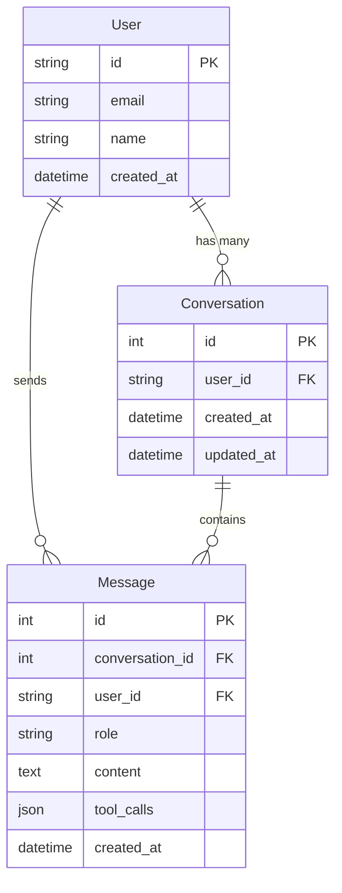

# Data Model: Chat API + Chat UI

**Feature**: 007-chat-interaction-layer  
**Date**: 2026-02-06

## Entity Relationship Diagram



## Entities

### Conversation

**Purpose**: Container for a chat session between user and AI assistant.

| Field      | Type        | Constraints                    | Description                    |
| ---------- | ----------- | ------------------------------ | ------------------------------ |
| id         | INTEGER     | PK, AUTO_INCREMENT             | Unique conversation identifier |
| user_id    | VARCHAR(36) | FK → users.id, NOT NULL, INDEX | Owner of the conversation      |
| created_at | TIMESTAMP   | NOT NULL, DEFAULT NOW()        | When conversation started      |
| updated_at | TIMESTAMP   | NOT NULL, DEFAULT NOW()        | Last activity timestamp        |

**Indexes**:

- `idx_conversation_user_id` on (user_id) - Filter by user
- Composite: (user_id, updated_at DESC) - Recent conversations first

**Validation Rules**:

- user_id must reference existing user
- updated_at must be >= created_at

---

### Message

**Purpose**: Individual message within a conversation.

| Field           | Type                      | Constraints                            | Description                        |
| --------------- | ------------------------- | -------------------------------------- | ---------------------------------- |
| id              | INTEGER                   | PK, AUTO_INCREMENT                     | Unique message identifier          |
| conversation_id | INTEGER                   | FK → conversations.id, NOT NULL, INDEX | Parent conversation                |
| user_id         | VARCHAR(36)               | FK → users.id, NOT NULL                | Message sender (for audit)         |
| role            | ENUM('user', 'assistant') | NOT NULL                               | Who sent the message               |
| content         | TEXT                      | NOT NULL, MAX 10000                    | Message body                       |
| tool_calls      | JSONB                     | NULLABLE                               | MCP tools invoked (assistant only) |
| created_at      | TIMESTAMP                 | NOT NULL, DEFAULT NOW()                | Message timestamp                  |

**Indexes**:

- `idx_message_conversation_id` on (conversation_id) - Filter by conversation
- Composite: (conversation_id, created_at) - Message ordering

**Validation Rules**:

- content must not be empty
- content max length: 10000 characters (applies to sanitized input)
- tool_calls only valid when role = 'assistant'
- conversation_id must reference existing conversation
- user_id must match conversation.user_id for 'user' role messages

---

## State Transitions

### Conversation Lifecycle

```
[New Message without conversation_id]
    ↓
CREATE Conversation
    ↓
[Message Exchange] ←→ Loop
    ↓
[No explicit deletion - persists indefinitely]
```

### Message Flow

```
[User submits message]
    ↓
Persist user message (role='user')
    ↓
Load conversation history
    ↓
Invoke AI Agent
    ↓
Receive response + tool_calls
    ↓
Persist assistant message (role='assistant', tool_calls=JSON)
    ↓
Return to client
```

---

## JSONB Structure: tool_calls

```json
[
  {
    "tool_name": "add_task",
    "arguments": {
      "user_id": "user_123",
      "title": "Buy groceries"
    },
    "result": {
      "success": true,
      "task_id": 42
    }
  }
]
```

---

## Database Migrations

### Migration 001: Create Conversations Table

```sql
CREATE TABLE conversations (
    id SERIAL PRIMARY KEY,
    user_id VARCHAR(36) NOT NULL REFERENCES users(id) ON DELETE CASCADE,
    created_at TIMESTAMP WITH TIME ZONE DEFAULT NOW() NOT NULL,
    updated_at TIMESTAMP WITH TIME ZONE DEFAULT NOW() NOT NULL
);

CREATE INDEX idx_conversation_user_id ON conversations(user_id);
CREATE INDEX idx_conversation_user_updated ON conversations(user_id, updated_at DESC);
```

### Migration 002: Create Messages Table

```sql
CREATE TYPE message_role AS ENUM ('user', 'assistant');

CREATE TABLE messages (
    id SERIAL PRIMARY KEY,
    conversation_id INTEGER NOT NULL REFERENCES conversations(id) ON DELETE CASCADE,
    user_id VARCHAR(36) NOT NULL REFERENCES users(id) ON DELETE CASCADE,
    role message_role NOT NULL,
    content TEXT NOT NULL CHECK (char_length(content) <= 10000),
    tool_calls JSONB,
    created_at TIMESTAMP WITH TIME ZONE DEFAULT NOW() NOT NULL
);

CREATE INDEX idx_message_conversation_id ON messages(conversation_id);
CREATE INDEX idx_message_conversation_created ON messages(conversation_id, created_at);
```

---

## SQLModel Definitions

```python
from sqlmodel import SQLModel, Field, Relationship
from sqlalchemy import Column, Enum as SAEnum, Text
from sqlalchemy.dialects.postgresql import JSONB
from datetime import datetime
from typing import Optional, List
import enum

class MessageRole(str, enum.Enum):
    user = "user"
    assistant = "assistant"

class Conversation(SQLModel, table=True):
    __tablename__ = "conversations"

    id: Optional[int] = Field(default=None, primary_key=True)
    user_id: str = Field(foreign_key="users.id", index=True)
    created_at: datetime = Field(default_factory=datetime.utcnow)
    updated_at: datetime = Field(default_factory=datetime.utcnow)

    messages: List["Message"] = Relationship(back_populates="conversation")

class Message(SQLModel, table=True):
    __tablename__ = "messages"

    id: Optional[int] = Field(default=None, primary_key=True)
    conversation_id: int = Field(foreign_key="conversations.id", index=True)
    user_id: str = Field(foreign_key="users.id")
    role: MessageRole = Field(sa_column=Column(SAEnum(MessageRole)))
    content: str = Field(sa_column=Column(Text))
    tool_calls: Optional[dict] = Field(default=None, sa_column=Column(JSONB))
    created_at: datetime = Field(default_factory=datetime.utcnow)

    conversation: Optional[Conversation] = Relationship(back_populates="messages")
```
